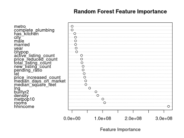

```{r setup, include=FALSE}
knitr::opts_chunk$set(echo = FALSE)
library(tidyverse)
library(data.table)
library(lmtest)
library(plm)
library(randomForest)
library(sandwich)
library(e1071)
library(ggplot2)
library(car)
library(kableExtra)
#library(gt)

# Setting this to FALSE will have figures and results load from being saved. You must have the results saved to use this.
# Otherwise, set to true to compute the models.
compute_models = FALSE

```

## Introduction

Housing markets play a crucial role in the economy, influencing household wealth, financial stability, and macroeconomic trends. Accurate forecasting of housing prices is essential for people and investors to make informed decisions on investments. However, housing prices are influenced by a wide range of factors, including macroeconomic indicators, demographic trends, interest rates, and localized supply-demand dynamics, making forecasting difficult.

We endeavor to develop and evaluate forecasting models that leverage econometric techniques to predict housing prices effectively. Using the American Consumer Survey (ACS) and Realtor Dot Com (RDC) data sets, we seek to accurately forecast housing prices. We compare our results with related work in the subject, compare the forecasting derived from our methodology and data sets with that of others to determine the most effective methods of housing price forecasting.

## Related Work

Forecasting housing prices is a well established discipline, with many economists attempting to determine significant factors and high performing models to increase prediction accuracy. Early econometric methods focus mostly on hedonic pricing models, where physical features such as square feet or number of rooms in the property are used in valuing a home [1]. While this approach is crucial in determining the value of a home, it ignores equally important effects on prices, including factors in the surrounding area, supply and demand trends in the area, and macroeconomic trends and events. To account for this, further developments in more comprehensive data sets has been conducted, which attempts to capture the highly complex and influential relationship between the many social, economic, and physical attributes of a property and its surrounding area. 

"House Price Prediction: A Multi-Source Data Fusion Perspective", by Y. Zhao, J. Zhao and E. Y. Lam explores home pricing by utilizing information on a property including physical characteristics, local amenities, traffic conditions, and emotional characteristics with multiple machine learning models to explore optimal feature and model selection. They continue the work done by Zhao et all [2], working with a comprehensive data set on Chinese real estate. The main contribution is the creation and evaluation of a comprehensive data set that uses a fusion of many sources to attempt to fully capture the state of a house that is sold. The data set includes the following feature groups for analysis:

* Property Features: This group includes basic characteristics of the houses, such as the location, number of bedrooms, number of bathrooms, and the year of construction. These are features consistent with classical hedonic pricing approaches.
* Amenity Features: These variables pertain to the proximity and count of various facilities and services in the vicinity of the property. They include the number of transportation facilities, educational institutions, healthcare centers, as well as the mean distance to these amenities.
* Traffic Data: This category captures the impact of transportation efficiency on house prices, including average traffic speed values and traffic flow data around each property.
* Emotional Sentiment Analysis: This group of variables is derived from the analysis of microblog posts to gauge the emotional climate associated with the property's location. It includes the distribution of emotions such as anger, dislike, happiness, sadness, and fear.

Together, these features of a home create a novel set of features to forecast house prices.

To forecast housing prices, Zhao et all utilize Support Vector Machines (SVM), linear regression, XGBoost, Random Forest, and Multi-Layer Perceptron (MLP) models. They choose these models for their high precision and consistency in price forecasting, and for the MLP's ability to accurately model complex and intricate relationships between features. Initial feature importance evaluation using a random forest model suggests that location, the number of educational institutions and attractions, as well the year are the most significant determinants of housing prices. This reinforces the use of features outside the traditional hedonistic approach, as qualities of the area surrounding the house are found to be much more significant than features of the house itself. Evaluation of their models using $R^2$, MAE, and RMSE reveals that the XGBoost and Random Forest models significantly outperform the linear regression, SVM, and MLP with up to 15 hidden layers. The decision tree based methods achieve an $R^2$ of 87.7% (XGBoost) and 89.3% (Random Forest), compared to the 55.7%, 36.5%, and 55.2% of the SVM, linear regression, and MLP respectively. Utilizing the highest performing method, Random Forest, a sensitivity analysis is performed to gain insight into the contribution of each feature on the prediction accuracy, as well as how variation in each feature results in variation in the prediction. They conclude that the location of a home is highly significant in prediction values, which is unsurprising since location is highly correlated with home values. The number of transportation facilities nearby is highly significant, suggesting that better infrastructure in an area can have a dramatic impact on a home's value. Additionally, a feature representing the relative level of anger in an area compared to other emotions has a significant influence on housing prices.

Through their creation and evaluation of a comprehensive data set on housing, Zhao et all provide insightful analysis on predictive factors of housing prices. Through the inclusion of information not commonly used in forecasting housing prices, they demonstrate the importance and complexity in house price forecasting. Finding that XGBoost and Random Forest models most accurately predict housing prices, it is evident that the interaction between the physical, social, and economic features of a property are complex and difficult to model, requiring the flexibility of the decision tree methods to accurately model them.

## Methodology

Working in the context of modern econometric and machine learning literature, we attempt to accurately forecast housing prices using the ACS and RDC data sets previously discussed. We build upon hedonic methods, incorporating data that captures the physical attributes of a home, as well exogenous data on economic trends in the area such as indicators for supply and demand. Including exogenous features allows us to model broader trends and capture more information that is used to appraise a home, infusing our models with more predictive power. The basis for using features not directly related to a specific property is established by Zhao et all [3]. We employ multiple linear regression as a baseline model to forecast prices, providing interpretable results for analysis. We further attempt to model the complex nonlinear relationships using both a Random Forest model, a proven highly accurate model [3], and a Support Vector Machine (SVM), a flexible model robust to noise. 

### Data

Our data used for forecasting combines ACS and RDC data, unifying the two by PUMA code, an alternative to ZIP codes that are used by the Census Bureau to describe geographic areas by county. The ACS data set provides household level information including physical characteristics of the house and surrounding area. The RDC data set has real estate market information by county, providing information on economic trends in the area. We first convert county information into PUMA codes, then join the two data sets by PUMA code. In total, there are roughly 300,000 observations in this data set.

In the ACS data, home values are self reported by household. As a result, many such entries are blank. All such entries are biased. As a result, we predict not housing prices, but rent adjusted for inflation using the Consumer Price Index.

We choose a training and testing split by year. Our train set consists of observations prior to 2022, and our test set contains observations from 2022 through 2024. This results in a 18% test 82% train split. 

```{r data_loading, include=FALSE, eval=compute_models}

# Load in the data. Ask me for the RDS if you do not have it and want it.
data = readRDS("~/DAR-DeFi-LTM-F24/EconDataLoading/ACS_RDC_by_PUMA_lat_lng.rds")
```

### Models

We use the classical linear regression model based on minimizing the sum of squared error:

$$
Y = \beta_0 + \beta_1 X_1 + \cdots + \beta_d X_d + e
$$
We include the full dimensionality of our data set, with $d = 22$. 


We use a Random Forest model:

$$
\hat f(x)  = \frac{1}{B} \sum\limits_{b=1}^{B} f_b (x)
$$
Where $\hat f(x)$ is the model output determined by taking the average of individual regression trees, $f_b(x)$ on an input $x$. A limitation to note in our model is that rather than using PUMA codes as factors, we instead convert FIPS codes into their average latitude and longitude coordinates to create numeric values. This is due to the random forest package being unable to handle thousands of factors.


We use a SVM Model:

$$
f(x) = \sum_{i=1}^{n} \alpha_i y_i K(x_i, x) + b
$$

where:
- \( \alpha_i \) are the Lagrange multipliers obtained from the dual form of the optimization problem,
- \( K(x_i, x) \) is the kernel function that computes the inner product in the higher-dimensional feature space.

and

$$
K(x_i, x_j) = \exp\left(-\frac{\|x_i - x_j\|^2}{2\sigma^2}\right)
$$

We choose a Gaussian Kernel for our forecasting, since there is no general relationship between rent and our other features.

To evaluate the performance of each of our models, we compute the following evaluation metrics:

$$
\text{Adjusted } R^2 = 1 - \left[ \frac{(1 - R^2) \times (n - 1)}{n - k - 1} \right]
$$
$$
\text{RMSE} = \sqrt{\frac{\sum\limits_{j=1}^n \left( y_j - \hat{y}_j \right)^2}{n}}
$$

## Results and Comparison

```{r forecast_funcs, include=FALSE, eval=compute_models}

adj_R2 <- function(model, test_data, response_var) {
  # Extract the actual response variable values
  actual <- test_data[[response_var]]
  
  # Predict the values using the model and test data
  predicted <- predict(model, newdata = test_data)
  
  # Compute residual sum of squares (RSS)
  RSS <- sum((actual - predicted)^2)
  
  # Compute total sum of squares (TSS)
  TSS <- sum((actual - mean(actual))^2)
  
  # Compute R2 (ensure non-negative)
  R2 <- 1 - (RSS / TSS)
  
  # Extract the number of observations (n) and predictors (p) from the model
  n <- nrow(test_data)
  p <- length(attr(model$terms, "term.labels")) - 1
  
  # Compute adjusted R2 (with additional safeguards)
  if (n > (p + 1)) {
    adj_R2 <- 1 - ((1 - R2) * (n - 1) / (n - p - 1))
  } else {
    warning("Not enough observations to compute adjusted R2")
    adj_R2 <- NA
  }
  
  return(adj_R2)
}


rmse = function(model, test_data, response_var){
  actuals = test_data[[response_var]]
  predictions = predict(model, test_data)
  
  rmse = sqrt(mean((actuals - predictions)^2))
  return(rmse)
}

rf_graph = function(RF_model){
  imp <- randomForest::importance(RF_model)

  # Order the feature importance (optional, to sort)
  ord <- order(imp[, 1], decreasing = TRUE)
  
  dotchart(imp[ord, 1], 
           xlab = "Feature Importance", 
           ylab = "", 
           main = "Random Forest Feature Importance")
    
}


filter_test_data <- function(train, test, column_name) {
  # Validate inputs
  if (!is.data.frame(train) || !is.data.frame(test)) {
    stop("Both train and test must be data frames")
  }
  
  if (!(column_name %in% colnames(train)) || !(column_name %in% colnames(test))) {
    stop(paste("Column", column_name, "not found in both train and test data frames"))
  }
  
  # Get unique factors in the train dataset for the specified column
  valid_factors <- unique(train[[column_name]])
  
  # Filter test data to keep only rows with factors present in train
  filtered_test <- test[test[[column_name]] %in% valid_factors, ]
  
  return(filtered_test)
}


get_train_test = function(df, features_to_drop, factor = ""){
  # Training split: years 2012-2020
  train <- df %>%
    filter(year >= 2016 & year <= 2021) %>% 
    select(-all_of(features_to_drop))
  
  test <- df %>%
    filter(year >= 2022) %>% 
    select(-all_of(features_to_drop))
  
  if(factor != ""){
    test = filter_test_data(train, test, factor)
  }
  
  return(list(train_data = train, test_data = test))
  
}

```

```{r OLS, include=FALSE, eval=compute_models}

# ===== OLS =====

# Get the data for the OLS model
OLS_drop = c("year_f", "cpi99", "pctmetro", "median_listing_price", "fips", "puma", "lat", "lng")
OLS_data = get_train_test(data, OLS_drop, factor = "location")

OLS_model = lm(cpi_rent ~ ., data = OLS_data$train_data)

# Extract the coefficients and standard errors
#coefs_OLS = coeftest(OLS_model, vcov = vcovHC, type = "HC0")
#print(coefs_OLS)

# Compute evaluation metrics
rmse_OLS = rmse(OLS_model, OLS_data$test_data, "cpi_rent")
adj_r2_OLS = adj_R2(OLS_model, OLS_data$test_data, "cpi_rent")

#save(OLS_model, file="OLS_model.RData")
```

```{r RF, include=FALSE, eval=compute_models}

# This is totally bad science but I need figures now...
data_trim = sample_n(data, 10000)

# ===== RF =====

RF_drop = c("year_f", "cpi99", "pctmetro", "median_listing_price", "fips", "puma", "location")
RF_data = get_train_test(data_trim, RF_drop)

RF_model = randomForest(cpi_rent ~ ., data = RF_data$train_data)

rmse_RF = rmse(RF_model, RF_data$test_data, "cpi_rent")
adj_r2_RF = adj_R2(RF_model, RF_data$test_data, "cpi_rent")

save(RF_model, file="RF_model.RData")

```

```{r SVM, include = FALSE, eval=compute_models}

# ===== SVM =====

SVM_drop = c("year_f", "cpi99", "pctmetro", "median_listing_price", "fips", "puma", "lat", "lng")
SVM_data = get_train_test(data_trim, SVM_drop, factor = "location")

tune_result = tune(svm, cpi_rent ~ ., data = SVM_data$train_data, ranges = list(cost = c(0.1, 1, 10), gamma = c(0.1, 0.5, 1)))

SVM_model = svm(cpi_rent ~ ., data = SVM_data$train_data, kernel = "radial", 
                       cost = tune_result$best.parameters$cost, 
                       gamma = tune_result$best.parameters$gamma)

rmse_SVM = rmse(SVM_model, SVM_data$test_data, "cpi_rent")
adj_r2_SVM = adj_R2(SVM_model, SVM_data$test_data, "cpi_rent")

save(SVM_model, file="SVM_model.RData")

```

```{r results_table}

# ===== Results =====

if(compute_models){
  R2s = c(adj_r2_OLS, adj_r2_RF, adj_r2_SVM)
  # Make a summary table of r2 and rmse
  results = data.frame (
    Model = c("OLS", "Rand. Forest", "SVM"),
    "Adj R2" = paste0(signif(R2s * 100,4), "%"),
    RMSE = c(rmse_OLS, rmse_RF, rmse_SVM)
  ) 
  
  saveRDS(results, file= "results.rds")
} else {
  results = readRDS("results.rds")
}

results %>%
  mutate(across(everything(), ~ cell_spec(., bold = (. == max(.)), format = "latex"))) %>%
  kable("latex", caption = "Out of Sample Model Performance Metrics") %>%
  kable_styling(bootstrap_options = c("striped", "hover", "condensed", "responsive"))
```

The table shows the adjusted $R^2$ and RMSE for each of our fitted models. We find that the linear regression is able to explain the most variance in the data, as it has the highest $R^2$. However, this is partially misleading, since the random forest was unable to use PUMA codes, and instead used continuous latitude and longitude values. The SVM and RF models both had lower RMSE values than linear regression, indicating that there is no clear model that outperforms any other in our forecasting.

```{r rf_plot, fig.align='center', out.width="70%"}
# Make a plot of variable importance from RF model
if(compute_models){
  plot = rf_graph(RF_model)
  ggsave("rf_imp_plot.png", plot = plot, width = 6, height = 4, dpi = 300)
} else{
  
}

```


Additionally, fitting a random tree model provides us with another metric for feature importance. Similar to statistical significance in linear models, feature importance from random forests provide a measure of how our forecast values deviate from the true value as we remove a feature. Clearly we see that household income (hhincome), is the most significant feature in forecasting the value of a home. Additionally, the number of rooms, population of the nearest metropolitan zone (metpop10), the population density in a PUMA area (density), location (lat, lng), and market indicators are the most significant.

Our modeling provides poor forecasting performance, but provides additional insight into useful factors for housing prices. Roughly half of the most important features are taken from the RDC data, signifiying the value of external market data when attempting to value an individuals home.


## References

1. E. Pagourtzi, V. Assimakopoulos, T. Hatzichristos and N. French, "Real estate appraisal: A review of valuation methods", J. Prop. Investment Finance, vol. 21, no. 4, pp. 383-401, 2003.
[https://www.emerald.com/insight/content/doi/10.1108/14635780310483656/full/html](https://www.emerald.com/insight/content/doi/10.1108/14635780310483656/full/html)

2. Y. Zhao, R. Ravi, S. Shi, Z. Wang, E. Y. Lam and J. Zhao, "PATE: Property amenities traffic and emotions coming together for real estate price prediction", Proc. IEEE 9th Int. Conf. Data Science and Advanced Analytics, pp. 1-10, 2022
[https://ieeexplore.ieee.org/document/10032416](https://ieeexplore.ieee.org/document/10032416)

3. Y. Zhao, J. Zhao and E. Y. Lam, "House Price Prediction: A Multi-Source Data Fusion Perspective," in Big Data Mining and Analytics, vol. 7, no. 3, pp. 603-620, September 2024
[https://ieeexplore.ieee.org/document/10654670/references#references](https://ieeexplore.ieee.org/document/10654670/references#references)

