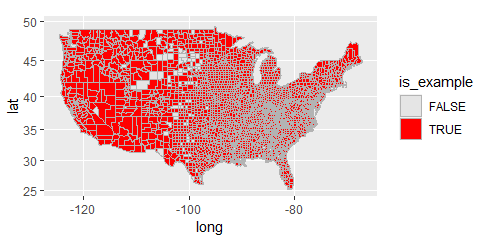
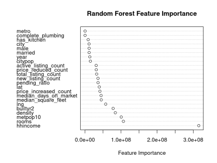

```{r, include=FALSE}
library(tidyverse)
library(knitr)

# Mohamed
library(tidysynth)

# Alejandro
library(maps)
library(mapproj)
library(stargazer)
library(sandwich)
library(lmtest)
library(car)
library(tigris)
library(sf)

# Emmet
library(data.table)
library(lmtest)
library(plm)
library(randomForest)
library(sandwich)
library(e1071)
library(kableExtra)

knitr::opts_chunk$set(out.width = '75%', out.height = '75%',
                      echo = FALSE, fig.align = 'center', 
                      message = FALSE)

plot_theme = theme_minimal() + theme(
  text = element_text(size = 16),
  axis.text = element_text(size = 12)
)
ggplot2::theme_set(plot_theme)

doacs = FALSE
docaus = TRUE
compute_models = FALSE
```

\doublespacing
\fontsize{12}{22}

# Introduction (Max)
Between 2020 and the present one thing is clear: housing prices have exploded. What isn't clear is why. The COVID-19 pandemic, radical changes in zoning law, and demographic shifts --- and their interplay --- confound a quick assessment of so clear a trend. With publicly available census and housing data, this paper looks to assess the major factors behind the rising price of housing. We begin with a discussion of market data from Realtor.com and expand into an analysis of the American Community Survey dataset.

# Literature Review
Kendall and Tulip (2018) quantify the effect of zoning on detached house prices in large cities in Australia. They argue that in the absence of zoning, the market for housing is competitive, as there are low barriers to entry and a large number of firms involved in development and construction. Additionally, they note that in US cities with loose zoning laws, prices are close to costs. Thus, the price of a property can be decomposed into the cost of the structure and land, and zoning representing supply distortions. With this approach, they find large price increases attributable to zoning. For example, in 2016, zoning raised the price of detached houses by 73 percent in Sydney and 69 percent in Melbourne. 

B. Yörük (2022) studies the effect of U.S. state-level COVID-19 policies on housing market activity using daily housing market data from Zillow.
Compared to 2019, Yörük finds that, "the closure of non-essential businesses in certain states was associated with up to an 11-percentage point decrease in new home listings and a 3.5 percentage point decrease in total inventory..."
and although restrictions on mass gatherings and school closures did not have a significant impact on the percentage change in new house listings, they did on the percentage change in overall inventory.
With respect to the median listing prices of houses, Yörük discovers, "a moderately increasing trend" after July 2020 which, "[remains] positive relative to its level during the same time period [2019]."
We aim to verify Yörük's finding with data from Realtor.com.


# Realtor Data
To see the effect of various market features on the median listing price of houses,
we use Resedential Data from Realtor.com which includes various housing market features listed by county Federal Information Processing Series (FIPS) codes and by date.
We extract `year` from the `date` field and, for parsimony, deselect all time variables with the exception of `year` and summarize the dataset by mean over `year` and `fips`.
This greatly reduces dimensionality and aids computation.

The data set contains 10,176 `NA` values from 4,761 observations (approximately 16.9% of all observations) which predominantly belong to rural counties where such information is difficult to obtain or is simply unavailable.
Consequently, we elide these variables in coming analysis.
Even with 16.9% of observations removed, Figure \@ref(fig:rdcmap) indicates that most of the country is still represented (counties with data are colored red):

```{r rdcmap, fig.cap = 'Counties with non-NA data'}

```

We further augment the data set by adding annually averaged consumer price index (CPI) as a measure of inflation. Table \@ref(table:realtor) visually summarizes the adjusted data set.

\begin{table}[h!]
\centering
\rowcolors{1}{}{lightgray!25}
\begin{tabularx}{\textwidth}{X|cccc}
                        \textbf{Variable} & $\mathbf{\mu}$ & $\mathbf{\sigma}$ & \textbf{Min} & \textbf{Max} \\
                        \hline
			fips & 30642.6 & 14957.9 & 01001 & 56045 \\
			year & 2020.3 & 2.54931 & 2016 & 2024 \\
			median\_listing\_price & 270042.4 & 196290.3 & 35750 & 4780104.1 \\
			active\_listing\_count & 337.33 & 920.55 & 1 & 21778.8 \\
			median\_days\_on\_market & 71.108 & 23.526 & 4 & 283 \\
			new\_listing\_count & 154.409 & 422.650 & 0 & 8615.33 \\
			price\_increased\_count & 11.18 & 47.42 & 0 & 1106.67 \\
			price\_reduced\_count & 97.23 & 317.94 & 0 & 9120 \\
			pending\_listing\_count & 165.70 & 498.57 & 0 & 11212 \\
			median\_listing\_price\_per\_square\_foot & 143.27 & 99.41 & 20 & 1877.11 \\
			median\_square\_feet & 1874.96 & 326.90 & 576 & 4844.09 \\
			average\_listing\_price & 377056.26 & 353401.63 & 35750 & 11998834.08 \\
			total\_listing\_count & 501.50 & 1361.03 & 1 & 30349.33 \\
			pending\_ratio & 0.541 & 0.472 & 0 & 5.581 \\
			cpi & 0.031 & 0.0219 & 0.012 & 0.08
\end{tabularx}
\caption{Realtor Data Set Summary}
\label{table:realtor}
\end{table}

## Realtor Data Processing

Before we begin our analysis, we start with an exploratory ordinary least squares (OLS) regression on the dependent variable `median_listing_price` to identify variables with a variance inflation factor (VIF) greater than 10, and then deselect those variables as well as those that *cheat* by also reflecting pricing information.
In so doing, we remove `active_listing_count`, `total_listing_count`, `pending_listing_count`, `median_listing_price_per_square_foot`, and `average_listing_price`.
We further subset the data to exclude entries for 2024, which is incomplete and does not have an annual average CPI value.

We further observe that a handful of counties are significantly wealthier than others, and consequently have much larger median listing prices.
Thus, we programatically remove outliers within the bottom 5% and top 5% of `median_listing_price`.
To account for time effects in the panel data, we adjust each observation's value of `median_listing_price` by its respective inflation rate.
Finally, we eliminate spatial effects by group demeaning the `median_listing_price` by FIPS and by introducing state factors which we favor in place of FIPS factors.

## Realtor Analysis

We now specify an unrestricted OLS regression with `median_listing_price` as our dependent variable and employ backward stepwise selection to produce a model with only the most important features.

We arrive at a model of the form
\begin{align*}
	\widehat{medianListingPrice}=-79010&-44.6\cdot medianDaysOnMarket\\
	&-26.9\cdot priceIncreasedCount\\
	&+13.37\cdot medianSquareFeet\\
	&+3795\cdot pendingRatio\\
	&+state\; factors +year\; factors
\end{align*}
With $\bar{R}^2=0.6$ and $F=489.5$.
Figure \@ref(fig:rdcprice) depicts the relationship between $medianListingPrice$ against $year$, with data points in blue and our predicted $\widehat{medianListingPrice}$ in red:

\begin{figure}[H]
	\centering
  \includegraphics[page=1,width=.4\textwidth]{Rplots.pdf}
	\caption{Median Listing Price vs. Year Violin Plot}
	\label{fig:rdcprice}
\end{figure}

Despite controlling for inflation, we have a strong time trend.
Of particular interest is the relatively large and highly significant coefficient on $pendingRatio$: $\hat\beta=\$3,795$ with $p<<0.05$.
Figure \@ref(fig:rdcpending) shows the change in $pendingRatio$ with time:

\begin{figure}[H]
	\centering
	\caption{Pending Ratio vs. Year}
	\label{fig:rdcpending}
	\includegraphics[page=2,width=.4\textwidth]{Rplots.pdf}
\end{figure}

As the pending ratio of housing is calculated as the share of pending listings over the share of active listings, an increase therefore indicates either a great leap in pending listings, or a major contraction in active listings.
Because the bump takes place during the COVID-19 pandemic, it is likely the decrease comes from a precipitous drop in active listings as work from home became the norm and people were largely locked in place.
The Realtor data for $activeListingCount$ supports this, marking a continuous downward trend starting in March 2020 and having a point of inflection in February 2022.
These findings are consistent with those of Yörök (2022).

# ACS Analysis

This section used the detailed data from the American Community Survey (ACS), an annual survey conducted by the U.S. Census Bureau that captures key social, economic, housing, and demographic information across the United States^[https://www.census.gov/programs-surveys/acs/]. The ACS dataset is a comprehensive resource for understanding the factors influencing rental housing prices. Specifically, the data includes demographic, geographic, and housing information as well as the locations from which the data was collected. 

Our analysis seeks to identify the variables that significantly impact rental housing prices and quantify their effect. We focus on demographic factors such as household income, geographic indicators like metropolitan status, and structural features of houses to examine their contributions to rental price variations.

Given the self-reporting status of housing value in the dataset, we concluded that rental prices were a more accurate measure of house value. For this reason, we decided to conduct our analysis using this as our dependent variable. By applying robust statistical methods we provide a deep exploration of the determinants of housing rental prices.

## Data Description

The dataset used in this study includes observations on rental housing units from the most recent ACS. Key variables of interest include:

* Monthly Rental Price: The dependent variable, representing the self-reported cost of renting a housing unit.

* Demographic Variables: These include household income, age of the householder, population density.

* Housing Characteristics: Information about the number of bedrooms, age of the property, kitchen and plumbing inclusion, and room number.

* Geographic Variables: Metropolitan versus rural location, and proximity to major urban centers.

The data was cleaned to ensure accuracy and consistency. The total number of observations was 56,835,321 with 29 features but after removing rows with missing or NA values for rental price or explanatory variables (76.5%) and selecting important features, we were left with 13,341,750 observations with 16 features. We made some additional data cleansing that left our final dataset with 9,491,177 observations of 16 variables. 

We are not including taxincl and insincl because those columns only have zeros. Likewise, we are excluding debt_incurred since it only has FALSE. Finally, year_from_start was removed given it was perfectly correlated with year.

```{r, eval=doacs}
acs = readRDS("acs_sample.rds")
# Not including taxincl, insincl and debt_incurred because first two only have zero
# and last one only has false

#year_from_start is perfectly correlated with year so we removed it.

data <- acs %>% select(year, density, metro, puma,
                        hhincome,
                        rooms, builtyr2, unitsstr, bedrooms,
                        age, married, male,
                        complete_plumbing, has_kitchen, statefip,
                       cpi_rent
                       ) %>%
  na.omit() %>%
  filter(year >= 2012) %>%
  mutate(year = as.factor(year))
  
```

The dataset contains observations from counties across the United States. However, due to challenges in obtaining complete information and the presence of missing values in the FIPS column, it does not provide a clear representation of individual counties. Instead, we looked at PUMAs (Public Use Microdata Samples), which "are non-overlapping, statistical geographic areas that partition each state or equivalent entity into geographic areas containing no fewer than 100,000 people each."^[https://www.census.gov/programs-surveys/geography/guidance/geo-areas/pumas.html]. Figure \@ref(fig:acsmap) highlights the regions from which we have data for the year 2019 (data is available for 2012-2022, this is only for visual aid).


```{r acsmap, eval=doacs, fig.cap = 'Regions with data present'}
# Set tigris options for retrieving data
options(tigris_use_cache = TRUE)

# Fetch PUMA shapefiles for the required states
# Use a loop or lapply to fetch PUMAs for all statefips in your dataset
puma_shapefiles <- lapply(unique(data$statefip), function(state) {
  pumas(state = state, cb = TRUE, year = 2020) # Download PUMAs for the given state
})

# Combine all state shapefiles into a single sf object
puma_combined <- do.call(rbind, puma_shapefiles)

# Filter PUMAs based on the dataset
highlighted_pumas <- puma_combined %>%
  filter(as.integer(STATEFP20) %in% data$statefip & as.integer(PUMACE20) %in% data$puma)

map_plot <- ggplot() +
  geom_sf(data = puma_combined, fill = "lightgray", color = "white", size = 0.2) + # Background PUMAs
  geom_sf(data = highlighted_pumas, fill = "red", color = "black", size = 0.4) +  # Highlighted PUMAs
  coord_sf(
    xlim = c(-130, -60), # Longitude limits for continental U.S.
    ylim = c(20, 55)     # Latitude limits for continental U.S.
  ) +
  theme_minimal() +
  labs(title = "Highlighted PUMAs",
       caption = "Source: U.S. Census Bureau") +
  theme(
    plot.title = element_text(size = 20, face = "bold", hjust = 0.5),
    plot.caption = element_text(size = 12),
    axis.text = element_blank(),  # Remove axis labels for clarity
    axis.ticks = element_blank()
  )

map_plot
```

Table \@ref(tab:acssum) provides an overview of the data distribution, highlighting significant variation in rental prices, income levels, and property characteristics. Such variation underscores the need for robust multivariate analysis to disentangle the effects of different predictors. It's important to note that the variable `hhincome` has significantly larger values compared with the rest of the predictors, this will be important when we estimate our OLS model.

```{r acssum, eval=doacs}
data <- data %>% mutate(statefip = as.factor(statefip)) %>% mutate(puma = as.factor(puma))
# Select only numeric variables
numeric_data <- data %>% select_if(is.numeric)

# Summarize the statistics for numeric columns
summary_table <- data.frame(
  Variable = colnames(numeric_data),
  Mean = round(sapply(numeric_data, mean, na.rm = TRUE), 2),
  Variance = round(sapply(numeric_data, var, na.rm = TRUE), 2),
  Min = round(sapply(numeric_data, min, na.rm = TRUE), 2),
  Max = round(sapply(numeric_data, max, na.rm = TRUE), 2)
)

rownames(summary_table) <- 1:nrow(summary_table)

# Print the table nicely
kable(summary_table, format = "markdown", caption = "Summary Statistics for Numeric Variables")
```

One variable that caught our attention was age. At first, we were surprised and confused by the presence of ages such as 0 years old or very young ages. However, after further investigation, we discovered that the ACS collects data on every person living in each household to ensure a more comprehensive and accurate measure. As a result, the age variable includes values ranging from 0 to 97.

Table \@ref(tab:acsfactors) summarizes the factor features and provides further insight into our dataset. As indicated by the FIPS feature, we have data from every state in the country, as shown by the 51 unique values in this feature. California (represented by FIPS code 06) is the most common state in the sample dataset. Additionally, the "year" feature contains 11 levels, corresponding to 11 years of data in the sample (2012-2022), with 2014 being the most commonly represented year.

```{r acsfactors, eval=doacs}
# Select only factor (categorical) variables
factor_data <- data %>%
  select_if(is.factor)

# Summarize the statistics for factor columns
summary_table2 <- data.frame(
  Variable = colnames(factor_data),
  `Number of Levels` = sapply(factor_data, function(col) length(unique(col))),
  `Most Frequent Level` = sapply(factor_data, function(col) names(sort(table(col), decreasing = TRUE)[1])),
  `Frequency of Most Frequent Level` = sapply(factor_data, function(col) max(table(col)))
)

# Print the table nicely
kable(summary_table2, format = "markdown", caption = "Summary Statistics for Factor Variables")
```


## Methodology

To analyze the determinants of rental prices, we adopted a two-way fixed effects multivariate linear regression model. This method allows us to evaluate the individual contribution of each explanatory variable while controlling for the time and regional effects. it is important to note that our dependent variable (rent) is the gross rent adjusted by inflation. The steps taken in the analysis are as follows:

Variable Selection: Using domain knowledge and exploratory data analysis, we identified variables with potential relevance to rental price determination.

Model Specification:

The primary model is specified as:

$$
Y = \beta_0 + \gamma_i * year_i + \theta_j * state_j + \beta_k * X_k + \epsilon
$$

Where:

* $Y$ represents the dependent variable (Rent price).
* $X_1, X_2, X_3,\dots, X_n$ are the independent variables (e.g., [density, metro, hhincome, rooms, builtyr2, unitsstr, bedrooms, age, married, male]).
* $year_i$ is the dummy variable for the year with $i \in \{1,\dots, 11\}$ as we're controlling for 11 years of data.
* $state_j$ is the dummy variable for the state with $j \in \{1,\dots, 51\}$ as we're controlling for all 50 states and the District of Columbia.
* $\beta_0$ is the intercept of the regression model.
* $\beta_1, \beta_2, \beta_3,\dots, \beta_n$ are the coefficients that represent the relationship between each independent variable and the dependent variable.
* $\gamma_i$ are the coefficients that represent the relationship between each year and the dependent variable.
* $\theta_j$ are the coefficients that represent the relationship between each state and the dependent variable.
* $\epsilon$ is the error term, capturing unobserved factors.

Model Estimation: To estimate the coefficients, we employed Ordinary Least Squares (OLS) regression. All models were estimated with heteroskedasticity-robust standard errors. Diagnostic tests were conducted to validate the model assumptions:

Multicollinearity: Variance Inflation Factors (VIF) were calculated to ensure no strong multicollinearity among the predictors.

Results for this primary model are displayed as column 1 of Table \@ref(tab:acsresults)

```{r acsresults, eval=doacs, results='asis'}
fit.lm_acs <- lm(cpi_rent ~ year + density + metro +
                        hhincome +
                        rooms+ builtyr2+ unitsstr+ bedrooms+
                        age+ married+ male+
                        statefip, data)

fit1 = coeftest(fit.lm_acs, vcov=vcovHC, type="HC0")

fit.lm_acs_noyear <- lm(cpi_rent ~ density + metro +
                        hhincome +
                        rooms+ builtyr2+ unitsstr+ bedrooms+
                        age+ married+ male+
                        statefip, data)

fit2 = coeftest(fit.lm_acs_noyear, vcov=vcovHC, type="HC0")

fit.lm_acs_nostate <- lm(cpi_rent ~ year + density + metro +
                        hhincome +
                        rooms+ builtyr2+ unitsstr+ bedrooms+
                        age+ married+ male, data)

fit3 = coeftest(fit.lm_acs_nostate, vcov=vcovHC, type="HC0")

fit.lm_acs_nostatenoyear <- lm(cpi_rent ~ density + metro +
                        hhincome +
                        rooms+ builtyr2+ unitsstr+ bedrooms+
                        age+ married+ male, data)

fit4 = coeftest(fit.lm_acs_nostatenoyear, vcov=vcovHC, type = "HC0")

rsq = function(lm_model) summary(lm_model)$adj.r.squared

stargazer(fit1, fit2, fit3, fit4, omit = c("year", "state"), dep.var.labels.include = F,
          column.labels = c("Main specification", "Time FEs only", "State FEs only", "No FEs"),
          dep.var.caption = "", label = "tab:acsresults", header = FALSE, 
          title = "Results of regressions", 
          add.lines = list(c("Adjusted $R^2$", rsq(fit.lm_acs), rsq(fit.lm_acs_noyear),
                             rsq(fit.lm_acs_nostate), rsq(fit.lm_acs_nostatenoyear))))
```


The VIF scores were computed to further validate the model in Table \@ref(tab:acsvif)

```{r acsvif, eval=doacs}
vif <- vif(fit.lm_acs)
kable(vif, format = "markdown", caption = "VIF values")
```

Before analyzing the results, we note that all estimates are statistically significant. After applying robust standard errors, each estimated coefficient remains significant. Furthermore, we computed the Variance Inflation Factor (VIF) scores to ensure the validity of the model. All VIF scores are below 5, indicating no strong multicollinearity. This confirms that our model is both reliable and robust.

Model Overview:
The regression model included a total of 71 predictors and was fitted using a dataset with 8,491,117 observations. The R-squared of 0.4315 indicates that 43.15% of the variance in CPI Rent is explained by the included predictors. The F-statistic ($ 9.181e^4, p < 2.2e^{-16}$) demonstrates that the overall model is statistically significant.

Key Results:

1. Time Trends:

Yearly dummy variables were included to capture temporal trends. Statistically significant coefficients ($p < 0.001$) indicate clear yearly variation in CPI Rent. For example, CPI Rent increased significantly in 2020 compared to the base year($\hat{\gamma_{2020}} = 71.80$, $p < 2.2e^{-16}$).

2. Population Density:

The coefficient for population density was small but highly significant ($\hat{\beta_{density}} = 0.003$, $p < 2.2e^{-16}$) indicating that higher population density is associated with marginal increases in the Consumer Price Index (CPI) Rent. However, given that population density values across most regions in the dataset are not significantly high, this suggests that density has a notable impact primarily in areas with exceptionally high population densities. This means the effect of population density on CPI Rent is significant, but only for a select group of regions where density levels are substantially higher than average.

3. Metro Areas:
The presence of metro designation (`metro == TRUE`) substantially increased CPI Rent ($\hat{\beta_{metro}} = 173.7$,$p < 2.2e^{16}$).

4. State Effects:
State fixed effects (`fips_state`) showed considerable variation. For example, being in state 15 (Hawaii) significantly increased CPI Rent ($\hat{\theta_{15}} = 552.87$, $p < 2.2e^{-16}$) relative to the baseline.

5. Housing Characteristics:
Variables like the number of rooms ($\hat{\beta_{rooms}} = 20.82$, $p < 2.2e^{-16}$) and the presence of complete plumbing ($\hat{\beta_{plumbing}} = 129.4$, $p < 2.2e^{-16}$) were positively associated with CPI Rent. Conversely, older age and inclusion of a kitchen had negative effects.

6. Household Income Influence:
While it may be surprising given the low coefficient on household income ($\hat{\beta_{hhincome}} = 0.002461$, $p < 2.2e^{-16}$), this feature was the most important determinant of rent prices by far. The reason lies on the fact that, as mentioned previously, the variable `hhincome` has values ranging from $-15700.00$ up to $2580000.00$, that makes the true contribution of this variable in the model to range from $-38$ up to $6349$ which has values significantly higher than any other feature in our model. Therefore, household income is the most important predictor of rent prices. 

7. Variance Inflation Factor (VIF) Analysis:
The VIF values for all predictors were below 3, except for bedrooms (GVIF =  $3.019$), indicating no severe multicollinearity. This strengthens the robustness of the model's coefficient estimates.

8. Residual Analysis:
The residual standard error was $353$, indicating the average deviation between observed and predicted values. Residuals ranged from $-6,089.9$ to $4,835.5$, with a median near zero, suggesting an overall balanced fit.

9. Limitations and Future Research:
Although the model captures significant variance, $56.85%$ of CPI Rent variability remains unexplained. Including additional predictors like economic trends, housing policies, and neighborhood amenities could enhance model performance.

Additionally, to further justify the use of a two-way fixed effects model, we conducted additional regressions on house rents using three alternative models:

* Time fixed effects only (no state fixed effects),
* State fixed effects only (no time fixed effects), and
* A model without either time or state fixed effects.

The results of these models are also summarized in Table \@ref(tab:acsresults).

Focusing on the adjusted R-squared values, we observe a significant drop when removing the state fixed effects, which suggests that much of the variation in the dependent variable is explained by differences across states. While removing time fixed effects doesn't result in a similar reduction in R-squared, this does not mean that time fixed effects are not important. There may be a number of possible explanations for this, the most likely is that time fixed effects may just capture less variation in the outcome compared to state fixed effects, or that their contribution to the variation is already explained by state effects or other independent variable in the model.

Thus, while the adjusted R-squared metric is an important metric, including time fixed effects is justified by their ability to control for temporal unobservable trends that would otherwise bias the model. Therefore, a two-way fixed effects model ensures a robust and reliable estimation of house rents across the U.S.

# Analysis of Specific Factors

## Data and Description
For rents, we use the data set of Fair Market Rents provided by the U.S. Department of Housing and Urban Development, which provides annual data on the 40th percentile of rent on a county level from 1995 onwards. Data on sales prices come from the Survey of Construction, administered by the U.S. Census Bureau and U.S. Department of Housing and Urban Development, and come in the form of quarterly median sales price of houses sold in the United States, from the start of 1963 until July 2024. Construction price indices for houses sold and houses under construction are also sourced from the Survey of Construction data. Indices for houses under construction are monthly from 1963, while indices for houses sold are quarterly from 1963. Both are Laspreyes price indices, with the houses sold index being based on the cost of building the house and the value of the land, and the houses under construction index being based on only the cost of building the house. The CPI series used is the index for all urban consumers and all items, and comes from the Bureau of Labor Statistics, and is available on a monthly basis until September 2024. We also use the Realtor.com data set as explained earlier.

### Analyzing Supply Costs

```{r}
constr = read_csv("CausalAnalysis/Final/ConstructionPriceIndex/CONSTR.csv")

plotConstrVars = function(vars, after = 2012){
  constr2 = constr %>% 
    filter(year >= after) %>% 
    pivot_longer(all_of(vars))
  
  breaks = (constr2$date %>% unique)[seq(1, length(constr$date), by = 6)]
  
  ggplot(constr2) +
    geom_line(aes(x = date, y = value)) +
    facet_wrap(name ~ ., ncol = 1, scales = "free_y") +
    scale_x_continuous(breaks = breaks,
                       guide = guide_axis(angle = 45))
}
```


Traditional economic models state that the price of a good is affected by the demand and supply functions. A change in the supply function for housing from, for example, an increase in construction costs or the price of land would increase the price of housing. We can control for these factors with the Survey of Construction's price indices. We divide median price of purchased houses by the houses sold index to yield the variable sold_corrected: the price of houses relative to cost of construction and land, thus controlling for the cost of supply.

As shown in Figure \@ref(fig:allyears), House price data shows a significant break around 2011, in the aftermath of the Great Recession. Given the massive effect the Great Recession had on the housing market and the large government response, the sharp increase in housing prices may represent a structural break in the data. For this reason we prefer to limit our data range to 2012 onwards.

```{r allyears, fig.cap = 'Graph of sold corrected 1992-2023'}
plotConstrVars("sold_corrected", 0) +
  theme(axis.text.x = element_text(angle = 45, hjust = 0))
```
In figure \@ref(fig:causprices) We contrast prices controlled for inflation only with CPI (cpi_mspus) to prices controlled for with the houses sold index. The most striking feature of this figure is that while cpi_mspus sees a sharp increase in prices starting at roughly 2020, sold_corrected remains stable. Additionally, while cpi_mspus increases steadily until roughly 2018 and stabilizes until 2020, sold_corrected starts stable and then decreases.
```{r causprices, message=FALSE, fig.cap = 'Comparison between cpi mspus and sold corrected'}
plotConstrVars(c("sold_corrected", "cpi_mspus"))
```
While the methodology does not imply a causal interpretation, it seems highly likely that trends in the housing price are caused by trends in construction costs. Supply costs are a major factor in the cost of almost all goods, and it is hard to conceive of any confounding variable correlated with price and supply cost that could dwarf the effect of supply. Additionally, we graph inflation-controlled housing prices (cpi_mspus) and the inflation-controlled houses sold index (cpi_sold) in Figure \@ref(fig:causcpi) to show that trends in both coincide.
```{r causcpi, fig.cap = 'Comparison between cpi mspus and CPI-controlled houses sold index'}
plotConstrVars(c("cpi_mspus", "cpi_sold"))
```

One factor that could affect house sales price on the demand side is the interest rate: a lower interest rate increases the demand for housing due to more favorable terms on mortgages. To eliminate this factor, we also use the price of houses purchased with cash (full price up front with no mortgage or loan) which should be unaffected by the interest rate. This specification is presented in Figure \@ref(fig:causcash) After controlling with the houses sold index, we see the same general trend, albeit with much more volatility. The average price is stable until 2018, starts decreasing until 2020, then seems to stabilize again.
```{r causcash, fig.cap = 'Prices of houses purchased with cash controlled with houses sold index'}
plotConstrVars("sold_corrected_cash")
```

Additionally, we can control using the houses under construction index instead, which only accounts for construction costs, and contrast with the price controlled by houses sold index. We present this specification in Figure \@ref(fig:causconstr) Both variables appear near-identical, indicating construction costs as the main driver of the effect we see.
```{r causconstr, fig.cap = 'Comparison of houses sold and construction indices'}
plotConstrVars(c("constr_corrected", "sold_corrected"))
```

## Zoning synthetic controls
The practice of zoning, or restricting what types of construction can occur on certain areas, is often blamed for driving up the price of housing by artificially limiting supply. One particular form of zoning that receives significant attention is single-family zoning, only allowing the construction of single-family homes. As part of the comprehensive Minneapolis 2040 plan, taking effect January 1, 2020, Minneapolis passed a law ending single-family zoning, a feat few other cities have matched. Additionally, the city implemented inclusionary zoning, requiring developers to have some of their units to be rented at prices below certain percentages of median income in the area.

To assess the effectiveness of these policies in reducing local rents, we utilize a synthetic control approach, as we have no reason to believe the parallel trends assumption should hold. The control group is comprised of metro areas as designated by the U.S. Department of Housing and Urban Development in the states of Minnesota (which contains Minneapolis) and Wisconsin. One limitation of our data is that the metro area containing Minneapolis also contains the slightly smaller neighboring city of St. Paul, which was not directly affected by the laws passed. This should dilute the overall effect, but so long as there are no simultaneous shocks to housing prices in St. Paul, a causal interpretation is still possible. We could also expect to see spillover effects decreasing rent in St. Paul as landlords compete with lower prices. For predictive variables, we use population in 2010 and market factors from 2016.

Our results indicate a increase in rent in the metro area containing Minneapolis and St. Paul compared to the synthetic control. As outlined in Abadie et al. (2010), we compute Fisher's Exact p-value as 0.5714, indicating no signifiant change in rents. The results of the synthetic control model are presented in Table \@ref(tab:caussynthtable) and Figure \@ref(fig:caussynthfig). While the synthetic control fits very well from 2018-2020, the two years before the intervention period, it does not fit as well in the years before, which is a possible limitation of the model. 

```{r caussynthfig, fig.cap = 'Synthetic vs. observed fair market rent', eval = docaus}
fmr_synth = read_csv("CausalAnalysis/Final/Minnesota/FMR_synth.csv")

treat_date = 2020
treated_unit = "Minneapolis-St. Paul-Bloomington, MN-WI HUD Metro FMR Area"

synth = fmr_synth %>%
  synthetic_control(outcome = price,
                    unit = areaname22,
                    time = year,
                    i_unit = treated_unit,
                    i_time = treat_date) %>% 
  generate_predictor(time_window = 2016,
                     populat = pop2010,
                     mdom = median_days_on_market,
                     nlc = new_listing_count,
                     plc = pending_listing_count,
                     pic = price_increased_count,
                     msf = median_square_feet
                     ) %>%
  generate_weights() %>% 
  generate_control()

plot_trends(synth) + plot_theme + ggtitle("")
```

```{r caussynthtable, eval = docaus}
grab_synthetic_control(synth) %>% 
  rename(Synthetic = synth_y, Observed = real_y, Year = time_unit) %>% 
  mutate(Difference = Observed - Synthetic) %>% 
  kable(caption = "Results of synthetic control")
```
We observe an increase in rents instead of a decrease in rents, alleviating concerns that insignificance is caused by the breadth of the metro area containing Minneapolis. One reason for the insignificance of the effect to rent is that the elimination of single family zoning was less effective in reality than may have been imagined. Of the roughly 12,600 housing structures authorized in the Minneapolis-St Paul. metro area, only roughly 350 were 2-4 units^[https://www.census.gov/construction/bps/index.html], which could only a house a tiny fraction of the population of the cities and would make a small dent in rent prices.

# Forecasting

## Introduction

Housing markets play a crucial role in the economy, influencing household wealth, financial stability, and macroeconomic trends. Accurate forecasting of housing prices is essential for people and investors to make informed decisions on investments. However, housing prices are influenced by a wide range of factors, including macroeconomic indicators, demographic trends, interest rates, and localized supply-demand dynamics, making forecasting difficult.

We endeavor to develop and evaluate forecasting models that leverage econometric techniques to predict housing prices effectively. Using the American Consumer Survey (ACS) and Realtor Dot Com (RDC) data sets, we seek to accurately forecast housing prices. We compare our results with related work in the subject, compare the forecasting derived from our methodology and data sets with that of others to determine the most effective methods of housing price forecasting.

## Related Work

Forecasting housing prices is a well established discipline, with many economists attempting to determine significant factors and high performing models to increase prediction accuracy. Early econometric methods focus mostly on hedonic pricing models, where physical features such as square feet or number of rooms in the property are used in valuing a home (Pagourtzi et al., 2003). While this approach is crucial in determining the value of a home, it ignores equally important effects on prices, including factors in the surrounding area, supply and demand trends in the area, and macroeconomic trends and events. To account for this, further developments in more comprehensive data sets has been conducted, which attempts to capture the highly complex and influential relationship between the many social, economic, and physical attributes of a property and its surrounding area. 

Zhao et al. (2024) explore home pricing by utilizing information on a property including physical characteristics, local amenities, traffic conditions, and emotional characteristics with multiple machine learning models to explore optimal feature and model selection. They continue the work done by Zhao et al. (2022), working with a comprehensive data set on Chinese real estate. The main contribution is the creation and evaluation of a comprehensive data set that uses a fusion of many sources to attempt to fully capture the state of a house that is sold. The data set includes the following feature groups for analysis:

* Property Features: This group includes basic characteristics of the houses, such as the location, number of bedrooms, number of bathrooms, and the year of construction. These are features consistent with classical hedonic pricing approaches.
* Amenity Features: These variables pertain to the proximity and count of various facilities and services in the vicinity of the property. They include the number of transportation facilities, educational institutions, healthcare centers, as well as the mean distance to these amenities.
* Traffic Data: This category captures the impact of transportation efficiency on house prices, including average traffic speed values and traffic flow data around each property.
* Emotional Sentiment Analysis: This group of variables is derived from the analysis of microblog posts to gauge the emotional climate associated with the property's location. It includes the distribution of emotions such as anger, dislike, happiness, sadness, and fear.

Together, these features of a home create a novel set of features to forecast house prices.

To forecast housing prices, Zhao et all utilize Support Vector Machines (SVM), linear regression, XGBoost, Random Forest, and Multi-Layer Perceptron (MLP) models. They choose these models for their high precision and consistency in price forecasting, and for the MLP's ability to accurately model complex and intricate relationships between features. Initial feature importance evaluation using a random forest model suggests that location, the number of educational institutions and attractions, as well the year are the most significant determinants of housing prices. This reinforces the use of features outside the traditional hedonistic approach, as qualities of the area surrounding the house are found to be much more significant than features of the house itself. Evaluation of their models using $R^2$, MAE, and RMSE reveals that the XGBoost and Random Forest models significantly outperform the linear regression, SVM, and MLP with up to 15 hidden layers. The decision tree based methods achieve an $R^2$ of 87.7% (XGBoost) and 89.3% (Random Forest), compared to the 55.7%, 36.5%, and 55.2% of the SVM, linear regression, and MLP respectively. Utilizing the highest performing method, Random Forest, a sensitivity analysis is performed to gain insight into the contribution of each feature on the prediction accuracy, as well as how variation in each feature results in variation in the prediction. They conclude that the location of a home is highly significant in prediction values, which is unsurprising since location is highly correlated with home values. The number of transportation facilities nearby is highly significant, suggesting that better infrastructure in an area can have a dramatic impact on a home's value. Additionally, a feature representing the relative level of anger in an area compared to other emotions has a significant influence on housing prices.

Through their creation and evaluation of a comprehensive data set on housing, Zhao et all provide insightful analysis on predictive factors of housing prices. Through the inclusion of information not commonly used in forecasting housing prices, they demonstrate the importance and complexity in house price forecasting. Finding that XGBoost and Random Forest models most accurately predict housing prices, it is evident that the interaction between the physical, social, and economic features of a property are complex and difficult to model, requiring the flexibility of the decision tree methods to accurately model them.

## Methodology

Working in the context of modern econometric and machine learning literature, we attempt to accurately forecast housing prices using the ACS and RDC data sets previously discussed. We build upon hedonic methods, incorporating data that captures the physical attributes of a home, as well exogenous data on economic trends in the area such as indicators for supply and demand. Including exogenous features allows us to model broader trends and capture more information that is used to appraise a home, infusing our models with more predictive power. The basis for using features not directly related to a specific property is established by Zhao et al. (2024). We employ multiple linear regression as a baseline model to forecast prices, providing interpretable results for analysis. We further attempt to model the complex nonlinear relationships using both a Random Forest model, a proven highly accurate model (Zhao et al., 2024), and a Support Vector Machine (SVM), a flexible model robust to noise. 

### Data

Our data used for forecasting combines ACS and RDC data, unifying the two by PUMA code, an alternative to ZIP codes that are used by the Census Bureau to describe geographic areas by county. The ACS data set provides household level information including physical characteristics of the house and surrounding area. The RDC data set has real estate market information by county, providing information on economic trends in the area. We first convert county information into PUMA codes, then join the two data sets by PUMA code. In total, there are roughly 300,000 observations in this data set.

In the ACS data, home values are self reported by household. As a result, many such entries are blank. All such entries are biased. As a result, we predict not housing prices, but rent adjusted for inflation using the Consumer Price Index.

We choose a training and testing split by year. Our train set consists of observations prior to 2022, and our test set contains observations from 2022 through 2024. This results in a 18% test 82% train split. 

```{r data_loading, include=FALSE, eval=compute_models}

# Load in the data. Ask me for the RDS if you do not have it and want it.
data = readRDS("~/DAR-DeFi-LTM-F24/EconDataLoading/ACS_RDC_by_PUMA_lat_lng.rds")
```

### Models

We use the classical linear regression model based on minimizing the sum of squared error:

$$
Y = \beta_0 + \beta_1 X_1 + \cdots + \beta_d X_d + e
$$
We include the full dimensionality of our data set, with $d = 22$. 


We use a Random Forest model:

$$
\hat f(x)  = \frac{1}{B} \sum\limits_{b=1}^{B} f_b (x)
$$
Where $\hat f(x)$ is the model output determined by taking the average of individual regression trees, $f_b(x)$ on an input $x$. A limitation to note in our model is that rather than using PUMA codes as factors, we instead convert FIPS codes into their average latitude and longitude coordinates to create numeric values. This is due to the random forest package being unable to handle thousands of factors.


We use a SVM Model:

$$
f(x) = \sum_{i=1}^{n} \alpha_i y_i K(x_i, x) + b
$$

where:
- \( \alpha_i \) are the Lagrange multipliers obtained from the dual form of the optimization problem,
- \( K(x_i, x) \) is the kernel function that computes the inner product in the higher-dimensional feature space.

and

$$
K(x_i, x_j) = \exp\left(-\frac{\|x_i - x_j\|^2}{2\sigma^2}\right)
$$

We choose a Gaussian Kernel for our forecasting, since there is no general relationship between rent and our other features.

To evaluate the performance of each of our models, we compute the following evaluation metrics:

$$
\text{Adjusted } R^2 = 1 - \left[ \frac{(1 - R^2) \times (n - 1)}{n - k - 1} \right]
$$
$$
\text{RMSE} = \sqrt{\frac{\sum\limits_{j=1}^n \left( y_j - \hat{y}_j \right)^2}{n}}
$$

## Results and Comparison

```{r forecast_funcs, include=FALSE, eval=compute_models}

adj_R2 <- function(model, test_data, response_var) {
  # Extract the actual response variable values
  actual <- test_data[[response_var]]
  
  # Predict the values using the model and test data
  predicted <- predict(model, newdata = test_data)
  
  # Compute residual sum of squares (RSS)
  RSS <- sum((actual - predicted)^2)
  
  # Compute total sum of squares (TSS)
  TSS <- sum((actual - mean(actual))^2)
  
  # Compute R2 (ensure non-negative)
  R2 <- 1 - (RSS / TSS)
  
  # Extract the number of observations (n) and predictors (p) from the model
  n <- nrow(test_data)
  p <- length(attr(model$terms, "term.labels")) - 1
  
  # Compute adjusted R2 (with additional safeguards)
  if (n > (p + 1)) {
    adj_R2 <- 1 - ((1 - R2) * (n - 1) / (n - p - 1))
  } else {
    warning("Not enough observations to compute adjusted R2")
    adj_R2 <- NA
  }
  
  return(adj_R2)
}


rmse = function(model, test_data, response_var){
  actuals = test_data[[response_var]]
  predictions = predict(model, test_data)
  
  rmse = sqrt(mean((actuals - predictions)^2))
  return(rmse)
}

rf_graph = function(RF_model){
  imp <- randomForest::importance(RF_model)

  # Order the feature importance (optional, to sort)
  ord <- order(imp[, 1], decreasing = TRUE)
  
  dotchart(imp[ord, 1], 
           xlab = "Feature Importance", 
           ylab = "", 
           main = "Random Forest Feature Importance")
    
}


filter_test_data <- function(train, test, column_name) {
  # Validate inputs
  if (!is.data.frame(train) || !is.data.frame(test)) {
    stop("Both train and test must be data frames")
  }
  
  if (!(column_name %in% colnames(train)) || !(column_name %in% colnames(test))) {
    stop(paste("Column", column_name, "not found in both train and test data frames"))
  }
  
  # Get unique factors in the train dataset for the specified column
  valid_factors <- unique(train[[column_name]])
  
  # Filter test data to keep only rows with factors present in train
  filtered_test <- test[test[[column_name]] %in% valid_factors, ]
  
  return(filtered_test)
}


get_train_test = function(df, features_to_drop, factor = ""){
  # Training split: years 2012-2020
  train <- df %>%
    filter(year >= 2016 & year <= 2021) %>% 
    select(-all_of(features_to_drop))
  
  test <- df %>%
    filter(year >= 2022) %>% 
    select(-all_of(features_to_drop))
  
  if(factor != ""){
    test = filter_test_data(train, test, factor)
  }
  
  return(list(train_data = train, test_data = test))
  
}

```

```{r OLS, include=FALSE, eval=compute_models}

# ===== OLS =====

# Get the data for the OLS model
OLS_drop = c("year_f", "cpi99", "pctmetro", "median_listing_price", "fips", "puma", "lat", "lng")
OLS_data = get_train_test(data, OLS_drop, factor = "location")

OLS_model = lm(cpi_rent ~ ., data = OLS_data$train_data)

# Extract the coefficients and standard errors
#coefs_OLS = coeftest(OLS_model, vcov = vcovHC, type = "HC0")
#print(coefs_OLS)

# Compute evaluation metrics
rmse_OLS = rmse(OLS_model, OLS_data$test_data, "cpi_rent")
adj_r2_OLS = adj_R2(OLS_model, OLS_data$test_data, "cpi_rent")

#save(OLS_model, file="OLS_model.RData")
```

```{r RF, include=FALSE, eval=compute_models}

# This is totally bad science but I need figures now...
data_trim = sample_n(data, 10000)

# ===== RF =====

RF_drop = c("year_f", "cpi99", "pctmetro", "median_listing_price", "fips", "puma", "location")
RF_data = get_train_test(data_trim, RF_drop)

RF_model = randomForest(cpi_rent ~ ., data = RF_data$train_data)

rmse_RF = rmse(RF_model, RF_data$test_data, "cpi_rent")
adj_r2_RF = adj_R2(RF_model, RF_data$test_data, "cpi_rent")

save(RF_model, file="RF_model.RData")

```

```{r SVM, include = FALSE, eval=compute_models}

# ===== SVM =====

SVM_drop = c("year_f", "cpi99", "pctmetro", "median_listing_price", "fips", "puma", "lat", "lng")
SVM_data = get_train_test(data_trim, SVM_drop, factor = "location")

tune_result = tune(svm, cpi_rent ~ ., data = SVM_data$train_data, ranges = list(cost = c(0.1, 1, 10), gamma = c(0.1, 0.5, 1)))

SVM_model = svm(cpi_rent ~ ., data = SVM_data$train_data, kernel = "radial", 
                       cost = tune_result$best.parameters$cost, 
                       gamma = tune_result$best.parameters$gamma)

rmse_SVM = rmse(SVM_model, SVM_data$test_data, "cpi_rent")
adj_r2_SVM = adj_R2(SVM_model, SVM_data$test_data, "cpi_rent")

save(SVM_model, file="SVM_model.RData")

```

```{r resultstable}

# ===== Results =====

if(compute_models){
  R2s = c(adj_r2_OLS, adj_r2_RF, adj_r2_SVM)
  # Make a summary table of r2 and rmse
  results = data.frame (
    Model = c("OLS", "Rand. Forest", "SVM"),
    "Adj R2" = paste0(signif(R2s * 100,4), "%"),
    RMSE = c(rmse_OLS, rmse_RF, rmse_SVM)
  ) 
  
  saveRDS(results, file= "results.rds")
} else {
  results = readRDS("results.rds")
}
results[[2, "Model"]] <- "Random Forest"

results %>%
  mutate("Adj R2" = str_sub(Adj.R2, 1, -2) %>% as.numeric / 100) %>%
  select(-Adj.R2) %>%
  relocate(RMSE, .after = "Adj R2") %>%
  kable(format = "markdown", caption = "Out of Sample Model Performance Metrics")
```

The table shows the adjusted $R^2$ and RMSE for each of our fitted models. We find that the linear regression is able to explain the most variance in the data, as it has the highest $R^2$. However, this is partially misleading, since the random forest was unable to use PUMA codes, and instead used continuous latitude and longitude values. The SVM and RF models both had lower RMSE values than linear regression, indicating that there is no clear model that outperforms any other in our forecasting.

```{r rf_plot, fig.align='center', out.width="70%"}
# Make a plot of variable importance from RF model
if(compute_models){
  plot = rf_graph(RF_model)
  ggsave("rf_imp_plot.png", plot = plot, width = 6, height = 4, dpi = 300)
} else{
  
}

```


Additionally, fitting a random tree model provides us with another metric for feature importance. Similar to statistical significance in linear models, feature importance from random forests provide a measure of how our forecast values deviate from the true value as we remove a feature. Clearly we see that household income (hhincome), is the most significant feature in forecasting the value of a home. Additionally, the number of rooms, population of the nearest metropolitan zone (metpop10), the population density in a PUMA area (density), location (lat, lng), and market indicators are the most significant.

Our modeling provides poor forecasting performance, but provides additional insight into useful factors for housing prices. Roughly half of the most important features are taken from the RDC data, signifying the value of external market data when attempting to value an individuals home.

# Conclusion
With publicly available housing market and census data, this paper aimed to uncover the features explaining the increase of housing prices from 2020 on.
Yörük's (2022) analysis of a Zillow dataset and our own analysis of the Realtor.com dataset revealed that a sudden decrease in active listings --- and consequently an increase in pending ratio --- drove up median listing prices. Our analysis indicates that this trend continues beyond 2022.

We expanded our analysis by incorporating data from the American Community Census, allowing us to identify key determinants of rent prices, including household income levels, population density, and proximity to urban centers. The OLS regression results underscored the importance of controlling for temporal and spatial effects to ensure robust conclusions. Both our analyses of Realtor.com and ACS data offer actionable insights for policymakers, urban planners, and individuals seeking to address housing affordability challenges and determine the drivers of house and rent prices.

By examining the trends of supply costs alongside of housing prices, we notice a decrease in housing prices relative to supply cost since 2012, which we interpret as meaning increases in housing prices are likely due to increasing supply costs. We also examine a case of changing zoning laws in Minneapolis and find no significant effect.

By combining household and a market information for forecasting, we attempt to predict rent for households. Results from our analysis suggest that both market and household information are both critical for forecasting. However, our datsets do not contain sufficient information for accurate forecasting values, and collecting more information on economic, area, and social information will provide more accurate predictions. 

\newpage

# References

<div id="refs"></div>

\newpage

# Appendix

```{r}
contributions = tribble(
  ~Task, ~Contribution,
  "Data Cleaning", "Mohamed",
  "Realtor.com Analysis", "Max",
  "ACS Analysis", "Alejandro",
  "Specific Factors Analaysis", "Mohamed",
  "Forecasting Analysis", "Emmet",
  "Introduction", "Max",
  "Conclusion", "Everyone",
  "Paper Formatting", "Mohamed",
  "Presentation", "Everyone")
knitr::kable(contributions)
```


